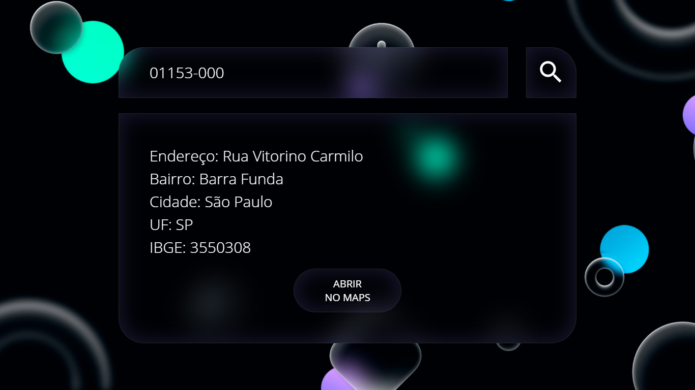

# Consulta CEP

## Introdução

Foram manipulados dados recebidos através de inputs para gerar um card com informações de endereço obtidas através da API ViaCEP, assim como um botão que abre o endereço encontrato no Google Maps.

## Techs utilizadas
* HTML: para estruturação da página;
* SASS: para estilização;
* JavaScript: para manipulação dos dados;
* [VIACEP](https://viacep.com.br/): API que consulta CEPs e retorna dados de endereço.